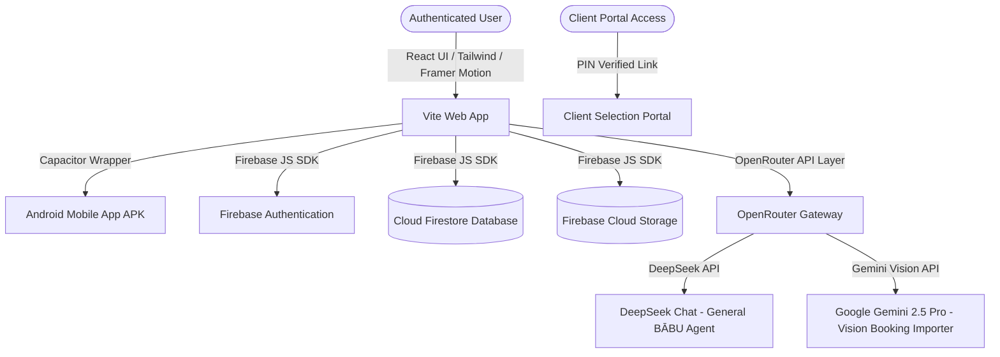
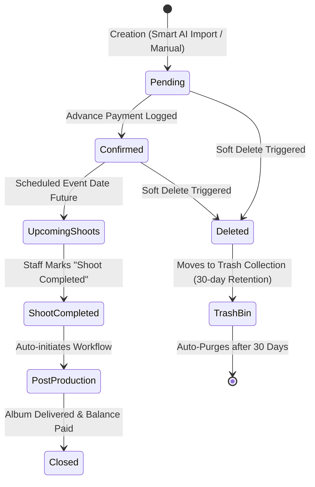
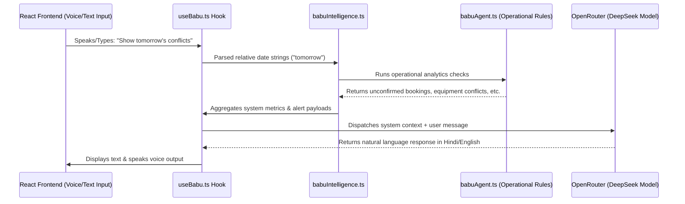

# Cameraman Pro: Studio Management System (Source of Truth)

This document serves as the absolute technical and operational "Source of Truth" for the internal **Cameraman Pro Studio Management System**. It outlines the core architecture, data schemas, security isolation, operations modules, client-facing workflows, and the predictive BĀBU AI intelligence engine.

---

## 1. Executive Summary & Overview

**Cameraman Pro** is a multi-tenant Studio Management System (SMS) designed specifically for photography and videography studios. The internal system provides studio owners, managers, coordinators, and field staff with tools to manage bookings, track post-production pipelines, schedule team members, monitor inventory availability, track financials, and communicate with clients.

### Target Audience & Use Cases
- **Developers:** Deep architectural details, database schemas, API parameters, and integration points to facilitate maintenance and extension.
- **Studio Owners & Managers:** High-level operational understanding of financial flows, inventory conflict resolution, and dashboard analytics.
- **Client Coordinators & Staff:** Understanding of the booking lifecycle, post-production statuses, client portals, and daily shift attendance check-ins.

### Strict Scope Boundaries
This documentation is strictly focused on the **internal studio management application** accessible by authenticated studio roles and clients via secure access portals. All public-facing marketing and promotional content (e.g., Landing Page, Hero Section, Public Galleries, Reviews, Public Enquiries) are excluded from this system documentation.

---

## 2. System Architecture & Tech Stack

Cameraman Pro is built on a modern, decoupled serverless architecture utilizing React, TypeScript, and Firebase.



### Core Technologies
1. **Frontend:** React 18, TypeScript, Vite, Tailwind CSS, Framer Motion (for interface animations), Lucide React (for iconography), and `react-hot-toast` (for UI notifications).
2. **Backend & Database:** Firebase Suite:
   - **Firebase Authentication:** Handles login credentials, session persistence, and social login (Google Sign-In).
   - **Cloud Firestore:** A document-based NoSQL database used to store studio profiles, bookings, financials, equipment, team details, and logs.
   - **Firebase Cloud Storage:** Stores studio assets, high-res images for selection portals, and staff profile photographs.
3. **Mobile Wrapper:** **CapacitorJS** is integrated to compile the web application into a native Android application. It utilizes native status bars and features Google Authentication via `@capacitor-firebase/authentication` to maintain seamless login windows in internal webviews.
4. **AI Layer:** Network integrations via the OpenRouter API gateway. It directs requests to:
   - `deepseek/deepseek-chat` for primary text operations (e.g. quote generation, chat responses, general intent parsing).
   - `google/gemini-2.5-pro` for visual OCR tasks (e.g. scanning contracts or screenshots).

---

## 3. Database Schema & Data Models (Firestore)

The database architecture is designed around multi-tenant scoping. Every record containing business-sensitive information is tagged with a `studioId` (or stored under a tenant-specific path) to enforce secure multi-tenant isolation.

### 3.1 Firebase Security Rules (`firestore.rules`)
Firestore enforces access control rules at the database level:
- `/users/{userId}`: Allows users to read and write only their own profiles.
- `/workspaces/{workspaceId}`: Restricted to users where their workspace ID matches the authenticated user ID or is explicitly marked as the workspace owner.
- `/studioSuite/{ownerUid}/{document=**}`: Scopes all documents nested under the studio suite to the owner's UID. Only the authenticated owner has read/write permissions.
- `/rentalManager/{ownerUid}/{document=**}`: Scopes rental operations to the owner.
- `/udhariKhata/{ownerUid}/{document=**}`: Scopes credit bookkeeping to the owner.

### 3.2 Data Models & TypeScript Types (`src/types/`)

#### A. UserProfile (`UserProfile`)
Represents an internal user account within the system.
```typescript
interface UserProfile {
    uid: string;
    name: string;
    email: string;
    phone?: string;
    photoURL?: string;
    studioId: string; // The primary multi-tenant isolation key
    role: 'owner' | 'admin' | 'photographer' | 'assistant' | 'client';
    createdAt: Timestamp;
}
```

#### B. Booking (`Booking`)
Links the client, scheduled events, financial statements, post-production statuses, and equipment assignments.
```typescript
interface Booking {
    id: string;
    studioId: string;
    clientName: string;
    clientPhone: string;
    clientAddress?: string;
    clientEmail?: string;
    eventType: EventType; // wedding | pre-wedding | birthday | corporate | other
    eventDate: Timestamp;
    venue: string;
    subEvents?: SubEvent[]; // Multi-event system support
    equipmentBooked: BookedEquipmentItem[];
    financials: FinancialRecord;
    postProductionStatus?: PostProductionStatus | null;
    teamAssignment?: TeamAssignment;
    contracts?: ContractFileMeta[];
    shootTimeline?: ShootTimelineEntry[];
    shootStatus?: 'upcoming' | 'completed';
    completedAt?: Timestamp | null;
    status: 'pending' | 'confirmed' | 'completed' | 'cancelled' | 'deleted';
    notes?: string;
    createdAt: Timestamp;
    updatedAt: Timestamp;
    createdBy: string;
    createdByName?: string;
}

interface SubEvent {
    id: string;
    title: string; // e.g. "Haldi", "Reception"
    date: string;  // YYYY-MM-DD
    time: string;  // HH:MM AM/PM
}
```

#### C. FinancialRecord & Paise Integers
To prevent floating-point calculation errors common in currency conversions, all monetary values in the database are stored as **integers representing Paise** (100 paise = 1 INR). The UI converts these values when display formatting.
```typescript
interface FinancialRecord {
    totalAmount: number; // Stored in paise (e.g. ₹50,000 -> 5000000)
    advancePaid: number; // Stored in paise
    balanceDue: number;  // Stored in paise (totalAmount - advancePaid)
    paymentHistory: PaymentTransaction[];
}

interface PaymentTransaction {
    id: string;
    amount: number; // paise
    method: 'cash' | 'upi' | 'bank_transfer' | 'cheque';
    date: Timestamp;
    notes?: string;
    referenceId?: string; // UPI transaction reference / Cheque number
}
```

#### D. InventoryItem (`InventoryItem`)
Represents individual studio hardware items.
```typescript
interface InventoryItem {
    id: string;
    studioId: string;
    name: string;
    category: 'camera' | 'lens' | 'lighting' | 'tripod' | 'accessory' | 'drone';
    status: 'available' | 'booked' | 'maintenance' | 'in_service' | 'damaged' | 'deleted';
    serialNumber?: string;
    purchaseDate?: Timestamp;
    condition?: 'new' | 'good' | 'fair' | 'poor';
    dailyRentalRate: number; // Stored in paise
    notes?: string;
    currentBookingId?: string | null;
}
```

#### E. StaffMember (`StaffMember`)
Manages staff profile information, check-in histories, and physical verification card statuses.
```typescript
interface StaffMember {
    id: string;
    employeeId: string; // Auto-generated e.g. "CP-1001"
    fullName: string;
    email?: string;
    phone: string;
    role: 'owner' | 'admin' | 'manager' | 'cameraman' | 'editor' | 'drone_operator' | 'studio_staff';
    status: 'active' | 'busy' | 'on_event' | 'offline' | 'suspended';
    profilePhoto?: string;
    joiningDate: string; // YYYY-MM-DD
    experience?: string;
    skills?: string[];
    studioId: string;
    idCardEnabled: boolean;
    isVerified: boolean;
    qrUrl?: string; // Links to staff public profile page for client verification
    totalEvents?: number;
    lastEventDate?: string;
    rating?: number; // Calculated average from historical events (1-5 scale)
    createdAt: Timestamp;
}
```

#### F. PhotoSession (`PhotoSession`)
Manages the post-production review gallery shared with clients for picture selection.
```typescript
interface PhotoSession {
    id: string;
    studioId: string;
    bookingId: string;
    clientName: string;
    eventType: string;
    eventDate: Timestamp;
    status: 'draft' | 'active' | 'locked' | 'delivered';
    accessCode: string; // e.g. "WED-X7K2" - deterministic client link code
    totalPhotos: number;
    maxSelections?: number;
    watermark?: WatermarkConfig;
    deadlineAt?: Timestamp;
    isLocked: boolean;
    notes?: string;
    createdAt: Timestamp;
}

interface WatermarkConfig {
    enabled: boolean;
    text: string;     // Text string overlays
    logoUrl?: string; // Cloudinary image ID
    opacity: number;  // 0 - 100
    position: 'center' | 'bottom-right' | 'bottom-left' | 'top-right';
}
```

#### G. Expense (`Expense`)
Enables tracking of operational outlays (fuel, helper wages, repair work) directly against bookings.
```typescript
interface Expense {
    id: string;
    studioId: string;
    amount: number; // Stored in paise
    category: 'fuel' | 'assistant_payment' | 'repair_maintenance' | 'miscellaneous';
    date: Timestamp;
    linkedBookingId?: string | null;
    linkedBookingName?: string; // Denormalized for rapid layout listing
    notes?: string;
    createdBy: string;
    createdAt: Timestamp;
}
```

#### H. TrashItem (`TrashItem`)
Supports soft-deleting documents (bookings, equipment, client files) to prevent accidental loss.
```typescript
interface TrashItem {
    id: string;
    originalCollection: 'bookings' | 'equipment' | 'clients';
    originalId: string;
    studioId?: string;
    data: any; // Complete JSON payload of the deleted document
    deletedBy: string;
    deletedAt: Timestamp;
    expiresAt: Timestamp; // Scheduled automatically to purge after 30 days
}
```

---

## 4. Core Operational Modules

### 4.1 Booking Management & Timeline Lifecycle

The booking system handles scheduling shoots and detailing client parameters.



- **Smart Booking Importer (`SmartBookingImportModal`):**
  Enables importing information by submitting raw conversation text transcripts or screenshots of bookings. The modal invokes `parseBookingText` or `parseBookingImage` using OpenRouter AI. The AI isolates details (client name, phone, dates, venue, advances) and populates the booking configuration form, reducing manual data entry.
- **Shoot Timeline Creator:**
  Enables coordinators to create chronological timelines for shoot days (e.g. "08:00 AM - Bride Arrival", "11:00 AM - Baraat Procession"). This ensures photographers, drone operators, and helpers follow a structured schedule.

### 4.2 Post-Production Workflow Tracker
Once a shoot status changes to `completed`, the system tracks the production pipeline using four steps:
1. **Data Backup:** Confirming raw memory cards are successfully stored in local drives or cloud backups.
2. **Photo Editing:** Color correction and image selections are ongoing.
3. **Video Mixing:** Cinematic film cuts and teaser mixes.
4. **Album Sent:** Design proofs sent and printed layouts dispatched to the client.

- **Auto-Calculated Progress:** The system automatically calculates progress in 25% increments (e.g., 2 tasks finished = 50% progress).
- **Assigned Editors:** Tasks can be assigned to internal editors or photographers. They check off finished stages directly, updating the booking detail view.

### 4.3 Inventory & Gear Management
Maintains studio equipment availability, preventing double-bookings.
- **Availability Matrix:** Tracks gear status (`available`, `booked`, `maintenance`, `damaged`).
- **Rental Tracking:** If gear is rented out or assigned to external assistants, daily rates are calculated in paise.
- **Double-Booking Detection:** When adding gear to bookings, the system runs cross-checks on scheduled event dates. If a specific lens or camera body is assigned to multiple events concurrently, the system triggers conflict alerts through the BĀBU interface and blocks the action.

### 4.4 Team, Identity, & Attendance Management
Allows managers to verify staff identities and schedule shifts.
- **Studio Code Invitations:** To onboard team members, owners share a generated 6-letter alphanumeric studio code. Assistants enter the code to join the workspace directory.
- **Identity Cards:** Managers can generate digital ID cards with portrait photos, blood groups, and dynamic QR verification URLs linking to the public validation page (`/profile/:staffId`). Clients scan the card to verify staff authorization on shoot locations.
- **Shift Attendance Log (`AttendanceManager.tsx`):**
  Staff can check in daily. The system logs attendance statuses (`present`, `absent`, `half_day`, `on_leave`) and allows writing shift notes.
- **Ratings & History:** Tracks event count and performance ratings, computing a composite score for each staff member.

### 4.5 Client Selection Portal (`SelectionPortal.tsx`)
A client-facing interface that streamlines the photo selection process.
- **Secure Authentication:** Clients access their gallery using a deterministic code (e.g. `/select/WED-X7K2`).
- **Watermark Engine:** The system applies configurable watermarks (opacity adjustments and custom branding text) to prevent unauthorized downloads of unselected high-res photos.
- **Selection Interaction:** Clients scroll through grid layouts, filter images, and flag favorites.
- **Draft Saves & Final Submission:** Progress is auto-saved as draft states. Once finalized, the client submits the selection, locking the portal to prevent changes. Photographers can download a generated text list or a ZIP file containing the selected file names to begin retouching.

---

## 5. Financial Rules & Calculations

The Financial Module (`Expenses.tsx`, `ExpenseDetail.tsx`) tracks profit margins on a per-booking basis.

### paise Operations
To prevent floating-point rounding errors (e.g., `0.1 + 0.2 = 0.30000000000000004`), calculations are processed in paise. The UI formats these values back to Rupees:
$$\text{Rupees} = \frac{\text{Paise}}{100}$$

### Profit Matrix Calculations
- **Gross Revenue:** Sum of all booked event packages.
- **Operational Expenditures:** Direct operational costs (fuel, staff compensation, helper wages).
- **Net Profit:**
  $$\text{Net Profit} = \text{Gross Revenue} - \text{Total Expenses}$$

### Firestore Composite Indexes Requirement
To display expenses sorted by date, a composite index must be created. Without it, queries will fail with a `failed-precondition` error.
- **Required Index:**
  - Collection: `expenses`
  - Fields: `studioId` (ASC), `date` (DESC)
- **Error Resolution:** If the index is missing, the Firebase Client SDK outputs a direct console link to generate the index in the Firebase Console.

---

## 6. The BĀBU AI Intelligence Engine

The **BĀBU AI Engine** acts as an automated virtual manager, monitoring studio activities and offering natural language interactions.



### 6.1 BĀBU Agent Monitoring (`babuAgent.ts`)
The `BabuAgent` class monitors studio data to detect:
- **Unconfirmed Bookings:** Critical alerts if bookings remain `pending` within 24 hours of an event date.
- **Payment Reminders:** Warnings if client balances are overdue 3+ days post-event.
- **Equipment Conflict Alerts:** Identifies if a single gear item is assigned to multiple concurrent shoots.
- **Post-Production Tracking:** Warning triggers if editing or backups exceed typical completion times.
- **Notifications Schedule:** Configured to push reminders during core operational hours (6:00 AM - 10:00 AM).

### 6.2 Natural Language Processing (`babuIntelligence.ts`)
- **Fuzzy Search & Relative Dates:** Processes natural queries (e.g. "आज", "कल", "tomorrow", "haldi") using regular expressions to filter matching calendar dates.
- **Hindi Language Support:** The system prompt instructs BĀBU to communicate in Hinglish/Hindi, making it accessible to studio crew members.
- **Voice Response Synthesizer (`useBabu.ts`):** Supports voice input via speech-to-text APIs and speaks answers using the browser's native `SpeechSynthesis` engines.

---

## 7. Security & Environment Configuration

### 7.1 Key Environment Variables (`.env`)
The system requires the following environment variables. Do not commit these keys to version control.
```bash
# Firebase Credentials
VITE_FIREBASE_API_KEY=AIzaSyA1...
VITE_FIREBASE_AUTH_DOMAIN=cameraman-pro.firebaseapp.com
VITE_FIREBASE_PROJECT_ID=cameraman-pro
VITE_FIREBASE_STORAGE_BUCKET=cameraman-pro.appspot.com
VITE_FIREBASE_MESSAGING_SENDER_ID=908...
VITE_FIREBASE_APP_ID=1:908...:web:def...

# AI Service Credentials
VITE_OPENROUTER_API_KEY=sk-or-v1-...
```

### 7.2 Security Verification Checklist
1. **Multi-Tenant Isolation:** Ensure that all Firestore queries include a `where("studioId", "==", studioId)` filter.
2. **Access Control Verification:** Authenticate only authorized email addresses (e.g. `ckv3232@gmail.com` as the Master Owner role) to view financial reports and change staff roles.
3. **Database Rules Verification:** Run `firebase deploy --only firestore:rules` to deploy changes to security rules, protecting the database from external access.
